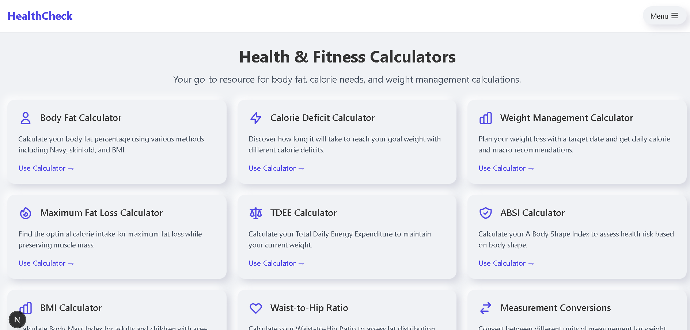

# HealthCheck

HealthCheck is a comprehensive health and fitness calculator web application built with Next.js, TypeScript, and TailwindCSS. It features a modern neumorphic design and provides a variety of calculators to help users track and understand their health metrics.



## Features

- **Multiple Health Calculators:**
  - BMI Calculator (for adults and children)
  - Body Fat Calculator
  - TDEE (Total Daily Energy Expenditure) Calculator
  - Calorie Deficit Calculator
  - Weight Management Planner
  - Maximum Fat Loss Calculator
  - ABSI (A Body Shape Index) Calculator
  - Waist-to-Hip Ratio Calculator
  - Measurement Conversions

- **Modern UI/UX:**
  - Neumorphic design elements
  - Responsive layout for all devices
  - Interactive components with real-time calculations
  - Smooth animations and transitions

- **Technical Features:**
  - Server-side rendering with Next.js
  - Type-safe code with TypeScript
  - Responsive styling with TailwindCSS
  - Progressive Web App (PWA) capabilities
  - SEO optimized with metadata
  - Accessibility focused

## Tech Stack

- **Frontend:**
  - [Next.js](https://nextjs.org/) - React framework for server-side rendering
  - [TypeScript](https://www.typescriptlang.org/) - Typed JavaScript
  - [TailwindCSS](https://tailwindcss.com/) - Utility-first CSS framework
  - [React](https://reactjs.org/) - UI library

- **Development Tools:**
  - [ESLint](https://eslint.org/) - Code linting
  - [Prettier](https://prettier.io/) - Code formatting

## Getting Started

### Prerequisites

- Node.js 18.x or higher
- npm or yarn

### Installation

1. Clone the repository:
   ```bash
   git clone https://github.com/yourusername/healthcheck.git
   cd healthcheck
   ```

2. Install dependencies:
   ```bash
   npm install
   # or
   yarn install
   ```

3. Run the development server:
   ```bash
   npm run dev
   # or
   yarn dev
   ```

4. Open [http://localhost:3000](http://localhost:3000) in your browser to see the application.

### Building for Production

```bash
npm run build
# or
yarn build
```

To start the production server:

```bash
npm run start
# or
yarn start
```

## Project Structure

```
healthcheck/
├── public/              # Static assets
├── src/
│   ├── app/             # Next.js App Router pages
│   │   ├── api/         # API routes and calculation functions
│   │   ├── bmi/         # BMI calculator page
│   │   ├── body-fat/    # Body fat calculator page
│   │   └── ...          # Other calculator pages
│   ├── components/      # Reusable React components
│   │   ├── ui/          # UI components (buttons, cards, etc.)
│   │   └── ...          # Other components
│   ├── constants/       # Constants and configuration
│   ├── hooks/           # Custom React hooks
│   ├── styles/          # Global styles
│   ├── types/           # TypeScript type definitions
│   └── utils/           # Utility functions
├── .eslintrc.json       # ESLint configuration
├── .gitignore           # Git ignore file
├── next.config.js       # Next.js configuration
├── package.json         # Project dependencies
├── postcss.config.js    # PostCSS configuration
├── tailwind.config.js   # Tailwind CSS configuration
└── tsconfig.json        # TypeScript configuration
```

## Calculator Descriptions

### BMI Calculator
Calculate your Body Mass Index (BMI) and find your healthy weight range based on your height. Includes special calculations for children and teens using age and gender-specific percentiles.

### Body Fat Calculator
Estimate your body fat percentage using various methods including Navy method, skinfold measurements, and more.

### TDEE Calculator
Calculate your Total Daily Energy Expenditure (TDEE) to determine your daily calorie needs based on your activity level.

### Calorie Deficit Calculator
Discover how long it will take to reach your goal weight with different calorie deficit levels.

### Weight Management Planner
Plan your weight loss or gain journey with a target date and get daily calorie recommendations.

### Maximum Fat Loss Calculator
Find the optimal calorie intake that maximizes fat loss while minimizing muscle loss.

### ABSI Calculator
Calculate your A Body Shape Index (ABSI) to assess health risks related to body shape and waist circumference.

### Waist-to-Hip Ratio Calculator
Determine your waist-to-hip ratio to assess health risks associated with abdominal fat.

### Measurement Conversions
Convert between different units of measurement for weight, height, volume, and more.

## Contributing

This is a private repository. Please contact the repository owner for contribution guidelines.

## License

This project is proprietary and confidential. Unauthorized copying, distribution, or use is strictly prohibited.

## Acknowledgements

- [Next.js Documentation](https://nextjs.org/docs)
- [TailwindCSS Documentation](https://tailwindcss.com/docs)
- [Neumorphism UI Design](https://neumorphism.io/)
- Health calculation formulas from various scientific sources (referenced in the code)
